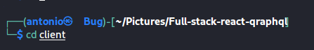

# Overview

This is the assessment that was sent to me by  SovTech, it is a full-stack assessment requiring me to develop both the frontend with (React,)  and backend using grapgql.

# Project Structure

The project is managed with Yarn and Yarn Workspaces. It is mono-repo housing 2 seperate projects, the React frontend and the server on Apollo GraphQL backend.

Click links below to read documentation on how to get started.

# Local development
Fork repository:  at [antonioferreiraSA/Full-stack-react-qraphql].(https://github.com/antonioferreiraSA/Full-stack-react-qraphql).

# Install Node.js dependencies

install all dependencies 

 $ cd /client 
 $ yarn install
 

 

 then create a .env file the place this code

  SKIP_PREFLIGHT_CHECK=true
 

# Start local server
 This will start the React front-end

 $ yarn start
 

 it will automatically open  http://localhost:3000/
 

 Dont worry if you only see a pciture with a error under it saying (Somthing went wrong ) this is becasue we need to startup the backend grapql server.

 # Start  backend grapql  server

  cd out of  the client folder to the root folder like this
  $ cd ..
 

 # Install Node.js dependencies
  $ yarn install

 

 $ cd src
 

 then to run it you need to install ts-node to run a typescript file 
 

 once done we ready to run the server
  $ ts-node index.ts

 

 we can now go back to our front-end  server and everything should work  http://localhost:3000/

 it should show you  this : 

 

 thank you very much for your time. 

 

 

